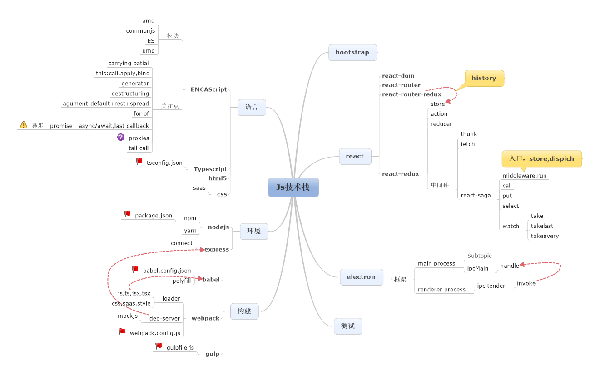

# my-first-electtron-app

练习

## Task

### Todo

- [ ] console
- [ ] 模板template
- [ ] 界面
- [ ] 皮肤
- [ ] 登陆与云存储

### In progress

- [ ] 编辑、保存
- [ ] 生成、预览
- [ ] 测试框架

### Done✓

- [x] 没有

## 技术参考



### 使用

. [emcascript](https://ecma-international.org)
. [Typescript](https://www.typescriptlang.org/zh/)
. [babel](https://babeljs.io/docs)
. [NodeJs](http://nodejs.cn/api/)
. [npm](https://www.npmjs.com/)
. [webpack](https://www.webpackjs.com/)
. [express](https://www.expressjs.com.cn/)
. [mock](http://mockjs.com/)
. [react](https://reactjs.org/) [中文](https://zh-hans.reactjs.org/)
. [react-redux](https://react-redux.js.org/)
. [redux-saga](https://redux-saga-in-chinese.js.org/)
. [electron](https://www.electronjs.org/docs)
. [bootstrap](https://getbootstrap.com/docs/5.0/getting-started/introduction/)
. [mochajs](https://mochajs.org/)
. [chaijs](https://www.chaijs.com/)

### 项目参考

. [vs code OSS](https://github.com/microsoft/vscode)

### 其它参考

. [commonjs](https://requirejs.org/docs/commonjs.html)
. [AMD](https://requirejs.org/docs/whyamd.html)
. [W3C](https://www.w3.org/)
. [MDN](https://developer.mozilla.org/zh-CN/docs/Web)
. [印记中文](https://docschina.org/)

## 拾遗

First off, you pretty much never want to write code that is a mix of callbacks and promises for async operations. If you're moving to promises or introducing some promises, then you probably want to refactor the callbacks in that same section of code into promises. For the appropriate types of operations, there are so many advantages of promises over plain callbacks that it is well worth the effort to convert when already working in an area of code.

Promises are great for:

Monitoring synchronous operations

观察状态

That need to notify only once (usually completion or error)

通知一次（完成或出错）

Coordinating or managing multiple asynchronous operations such as sequencing or branching async operations or managing multiple operations in flight at the same time

多异步任务协同

Propagating errors from nested or deeply nested async operations

多层error冒泡

Getting code ready for the use of async/await (or using it now with a transpiler)

便于使用async/await

Operations that fit the Promise model where there are only three states: pending, fulfilled and rejected and where the state transitions from pending => fulfilled or from pending => rejected can then not change (a single one-way transition).

promise模型三种状态清晰，pending=>fulfiled,pending=>rejected

Dynamically linking or chaining asynchronous operations (such as do these two async operations, examine the result, then decide which other async operations to do based on the intermediate result)

方便链式操作

Managing a mix of asynchronous and synchronous operations

Automatically catching and propagating upwards any exceptions that occur in async completion callbacks (in plain callbacks these exceptions are sometimes silently hidden).

Plain callbacks are good for things that promises cannot do:

Synchronous notifications (such as the callback for Array.prototype.map())

同步通知

Notifications that may occur more than once (and thus need to call the callback more than once).

多次通知

Promises are one-shot devices and cannot be used for repeat notifications.

重复通知

Situations that cannot be mapped into the pending, fulfilled, rejected one-way state model.

适和于promise三态模型无法解决的情况

And, I'd also add EventEmitter to the mix.

EventEmitters are great for:

Publish/subscribe type notifications

An interface with an event model, particular when events can occur more than once (like streams)
Loose couplings when 3rd party code wants to participate or monitor something without any more of an API than an eventEmitter. No API to design. Just make an eventEmitter public and define some events and the data that goes with them.

Notes about converting plain callback code to Promises

If your callbacks fit the node calling convention with the callback passed as the last argument and called like this callback(err, result), then you somewhat automatically wrap the parent function in a promise with util.promisify() in node.js or if using the Bluebird promise library, with Promise.promisify().

With Bluebird, you can even promisify an entire module (that uses async callbacks in the node.js calling convention) at once such as:

```js
const Promise = require('bluebird');
const fs = Promise.promisifyAll(require('fs'));

fs.writeFileAsync("file.txt", data).then(() => {
    // done here
}).catch(err => {
    // error here
});
```

In node.js version 8+

There is now util.promisify() which will convert an async function that uses the node.js async calling convention to a function that returns a promise.

Example from the doc:

```js
const util = require('util');
const fs = require('fs');

const stat = util.promisify(fs.stat);

// usage of promisified function
stat('.').then((stats) => {
  // Do something with `stats`
}).catch((error) => {
  // Handle the error.
});
```
